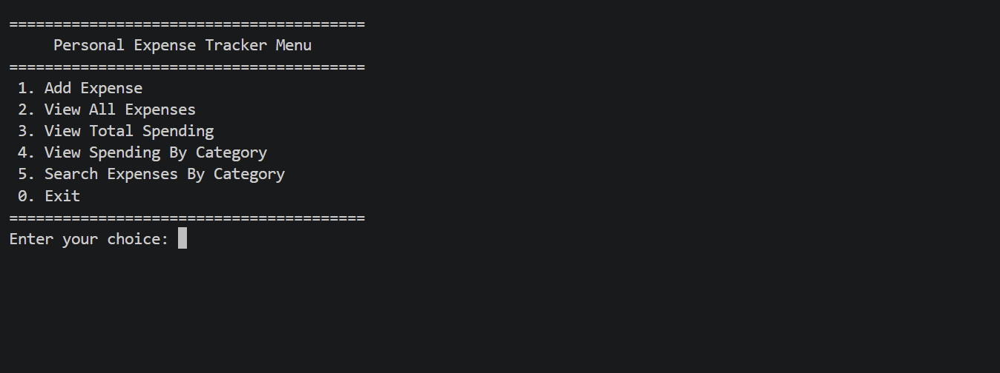
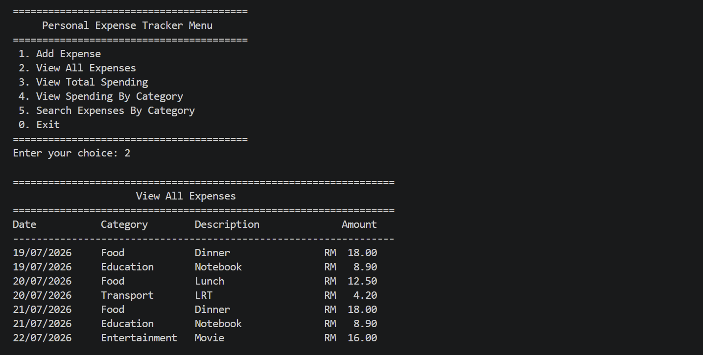
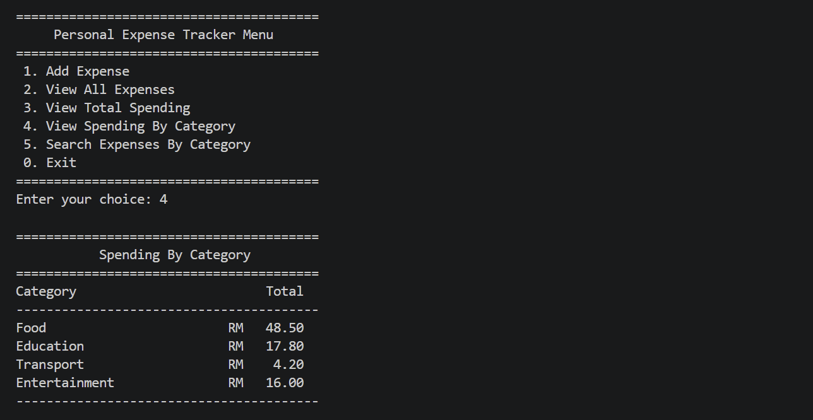

# Personal Expense Tracker

A command-line Python application that allows users to record, view, search and analyse personal expenses. The program stores records in a CSV file and includes input validation and error handling.

## Features

- Add a new expense
- View all expense records
- Calculate total spending
- View spending grouped by category
- Search expenses by category
- Validate expense amounts
- Handle empty, incomplete and missing files

## Technologies Used

- Python
- CSV file handling
- Visual Studio Code

## Expense Information

Each expense contains:

- Date
- Category
- Description
- Amount

## How to Run

1. Download or clone the project.
2. Open the project folder in Visual Studio Code.
3. Make sure Python is installed.
4. Run `main.py`.
5. Choose an option from the menu.

## Project Files

- `main.py` — contains the main program
- `expenses.csv` — stores expense records
- `README.md` — explains the project

## What I Learned

- Breaking a program into smaller functions
- Reading and writing CSV files
- Validating user input
- Using loops and conditions
- Using dictionaries to group expenses
- Searching and filtering records
- Handling file and value errors

## Screenshots

### Main Menu

### View All Expenses

### Spending by Category

